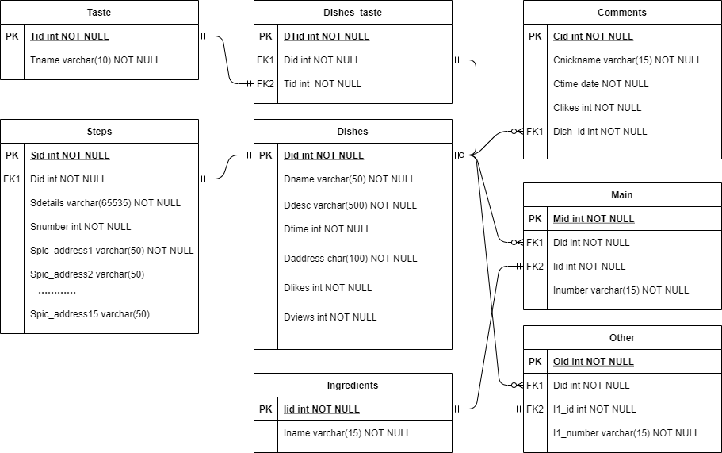

# **TEAM LOG**
### April 19th
#### Database build

* Build database with MySQL and deploy it on Tencent Cloud;

* The database contains information of dishes, tastes, ingredients, cooking steps, users' comments and the related pictures;

***
### April 10th
#### Angular build

* Set up 4 components: home, customize, slotmachine, dish;

* Complete app.component.html & .css, home.component.html & css;

***
### April 8th
#### 2nd team division
|name|task|
|:--:|:--:|
|Jie|Data collection, database management;|
|Xinyuan| Backend design & management; |
|Kang| Frontend work & website build;|
|Wanqing| website test, document writing, github maintenance;|
|Yiyuan| Frontend work & website build, project management;|

#### Meeting
1. The front end is developed using Angular CLI. The project is currently tentatively composed of 4 components: home page, custom page, slot machine page, and recipe page.

2. It specifies the API used by the backend; specifies the data return format (json format) and the functional requirements of the API.

3. Determine MySQL as the database of the project.
***
### April 7th
#### update ER diagram
ER diagram:

***
### April 4th:
#### initial homepage

1. Complete the HTML layout and CSS settings of the homepage.

2. Specifies the styles of the web navigation toolbar and the tail navigation bar.
***
### April 1st:
#### update receipt prototype

receipt prototype:

***
### March 31st:
#### update customize prototype

customize prototype:

***
### March 28th:
#### update homepage prototype

homepage prototype:

***
### March 18th:
#### demand analysis

According to the teacher’s feedback, we need to conduct a needs analysis of our target groups to concretize the functional design of our website.

We will design a [questionnaire](https://www.surveymonkey.co.uk/r/VFX5QBK) to conduct a demand survey. The questions and options are as follows:
1. Are you struggling with what to eat every day?
* Yes
* No
2. Do you need a website that teaches you how to cook authentic Chinese food?
* Yes
* No
3. If there is a daily recipe recommendation website, do you want the website to have the function of determining recipes based on personal needs?
* Yes
* No
4. Do you want the daily recipe recommendation website to have a login function?
* Yes
* No

5. When you need to use a recipe website, do you prefer to use it on the mobile or desktop?
* Mobile  
* Desktop

**Collection of user information**
1. Your age:
* Under 18 years old
* 18-29 years old
* 30 years old and above

2. Your biological sex:
* Female
* Male

3. Are you Asian?
* Yes
* No
***

### March 11th:
#### 1st time Group division

| name | task |
|:----:| :--- |
|Yiyuan Chen| Website logo design, determination of UI style, document writing.|
|Kang Zhao| Website building; Back-end design.|
|Wanqing Zhang| Website building; Front-end design.|
|Xinyuan Li| Slot machine code implementation. |
|Jie Li| Recipe data collection and database construction.|

#### LOGO

***

### February 25th:
#### Website prototype & layout
According to the teacher’s request, the prototype of our website was discussed on this day.

Our idea is:
1. Put the Chinese dishes recommended today in the most prominent place on the homepage of the website.

2. The homepage provides a button for users to answer some set questions. According to the answers, we recommend Chinese dishes to users today.

3. The homepage shows some user comments.

4. The recipe page is displayed according to the cooking steps. The user reviews of this dish are displayed at the end of the recipe, displayed in descending order of the number of likes.

We first built the prototype of the website with [axure](https://q4r9fc.axshare.com).

**Notes:**
* The design and functions in the prototype may differ from the final project.
* The ownership of the prototype belongs to the current team members and no one can violate it. If plagiarism is found, the copyist will bear the corresponding responsibility.
***

### February 18 & 19th:
#### Ideas for specific functions of the website

We have discussed a lot about the specific functions of the daily recommended Chinese food website in the past two days.

In general, the website should have the following functions:
1. Showcase of Chinese cooking steps;

2. Comment anonymously on Chinese recipes;
3. Able to recommend daily Chinese dishes according to the needs of users;

4. The user's final recommendation of today's Chinese food is selected by the slot machine.

Regarding the anonymous comment function, our idea is that the user name of the comment displayed on the website is filled in every time the user submits a comment. This way, instead of using the login module, more users can use this website more conveniently without worrying about **privacy issues**.
***

### February 11th:
#### Brainstorming in the group
According to the game-theme matrix method provided by the teachers, we discussed two main ideas:
1. The first is the combination of Russian turntables and restaurant recommendations.

2. The second is slot machines and Chinese recipe recommendations.

All members of the group are interested in dining and love Chinese cuisine. And most of the members reported that they don't know what Chinese food to cook every day, and they want to discover new Chinese recipes.

So we are more interested in the idea of a website about recommending Chinese recipes every day.But **Difficulties** are:  
* The necessity of login system or just nickname (privacy problem)
* Personal information of users. (favorite, history, achievements)
* Source of recipe
***
